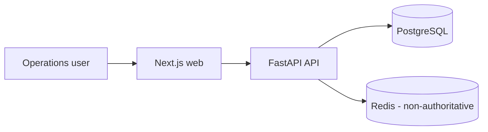

# System context

```mermaid
flowchart LR
  U[Operations user] --> W[Next.js web]
  W --> A[FastAPI API]
  A --> P[(PostgreSQL)]
  A --> R[(Redis - non-authoritative)]
```

Tenant identity comes from the authenticated user, never from arbitrary write payloads.
